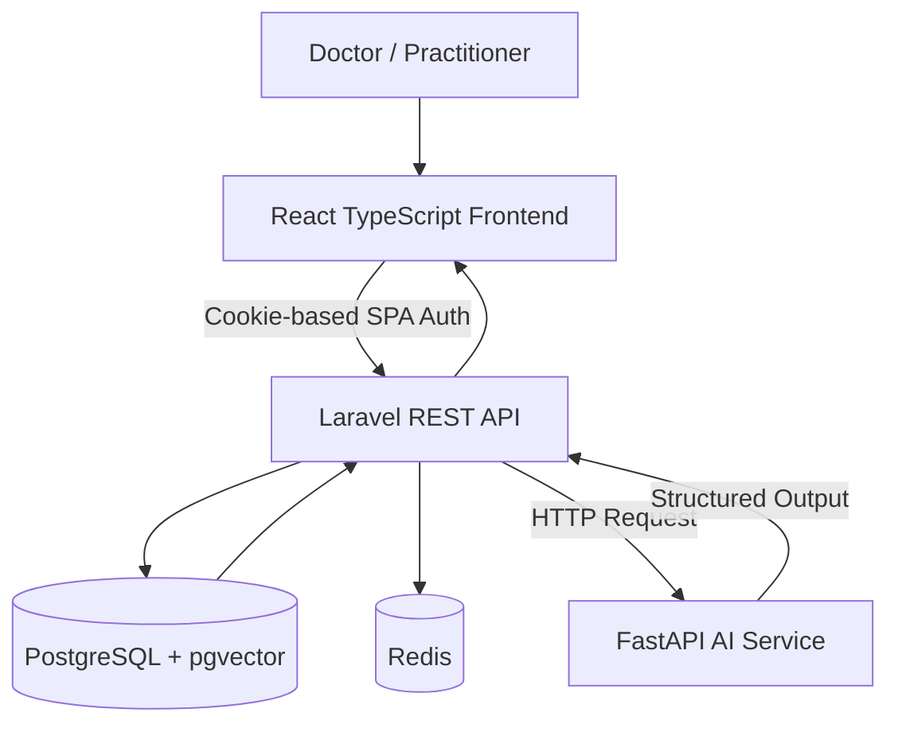
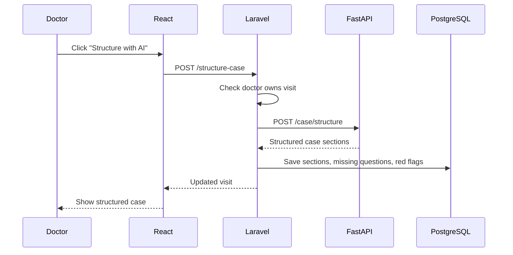
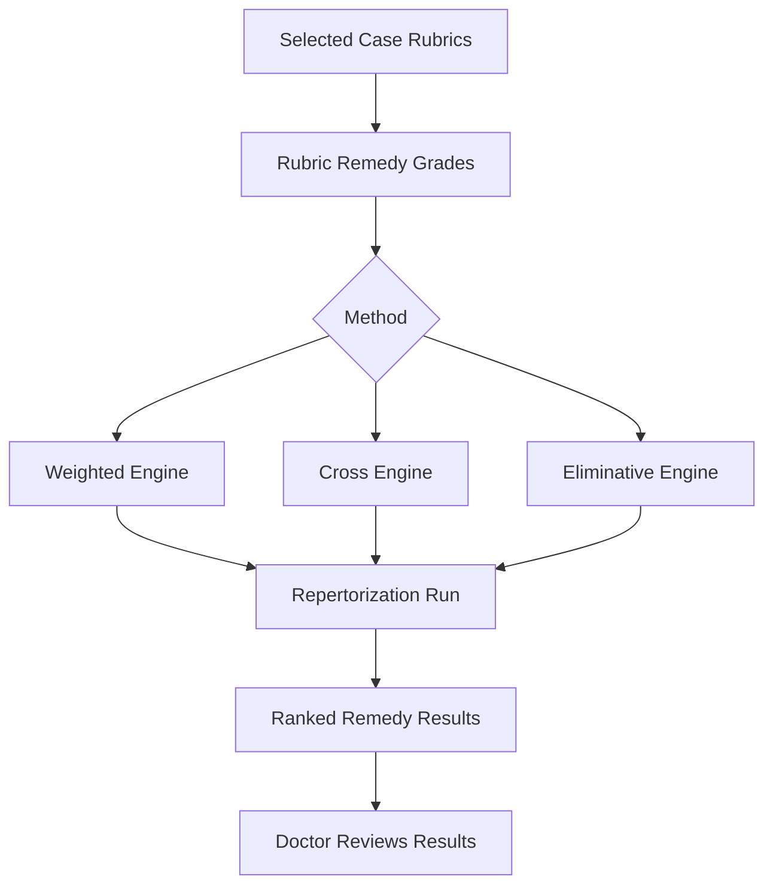
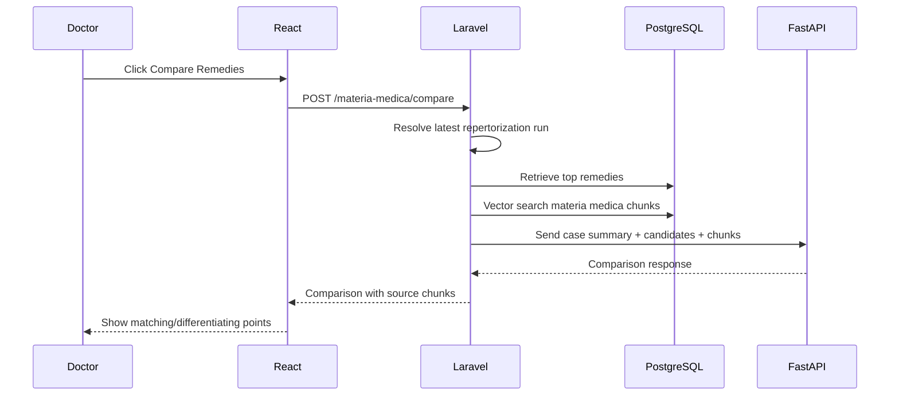

# Similia AI Architecture

## Overview

Similia AI is built as a multi-service clinical workspace.

The system has three main applications:

```text
React Frontend
Laravel Backend API
FastAPI AI Service
```

Supporting services:

```text
PostgreSQL + pgvector
Redis
```

---

## High-Level Architecture



---

## Service Responsibilities

### React Frontend

The frontend is responsible for:

- login UI
- doctor dashboard
- patient management
- visit and case-taking forms
- rubric selection UI
- repertorization result display
- materia medica comparison display
- prescription form
- fee form
- print pages
- patient timeline

Key libraries:

- React
- TypeScript
- React Router
- TanStack Query
- Axios
- Lucide React

---

### Laravel Backend API

The Laravel backend is the core application layer.

Responsibilities:

- authentication
- authorization
- patient ownership
- patient CRUD
- visit CRUD
- rubric selection
- repertorization engines
- materia medica retrieval
- prescription persistence
- fee persistence
- print data API
- patient timeline API
- communication with FastAPI AI service

Important architectural pattern:

```text
React never calls FastAPI directly.
React calls Laravel.
Laravel validates access.
Laravel calls FastAPI.
Laravel saves or returns the result.
```

This keeps:

- authentication centralized
- authorization consistent
- audit flow clean
- patient data protected

---

### FastAPI AI Service

The AI service is responsible for AI-like processing.

Current MVP responsibilities:

- case structuring
- missing question generation
- red flag detection
- materia medica comparison response generation

The current AI service is deterministic and local-first. It can later be upgraded to use:

- OpenAI
- Gemini
- Claude
- Ollama
- local embedding models
- hosted embedding models

---

### PostgreSQL and pgvector

PostgreSQL stores:

- users
- patients
- visits
- case sections
- repertory rubrics
- rubric remedy grades
- selected case rubrics
- repertorization runs
- repertorization results
- materia medica chunks
- prescriptions
- fees

pgvector stores materia medica embeddings:

```text
materia_medica_chunks.embedding vector(384)
```

This allows similarity search for relevant materia medica chunks.

---

### Redis

Redis is used for:

- caching
- queue-ready architecture
- future background jobs

Future use cases:

- AI comparison queue
- PDF generation queue
- scheduled follow-up reminders
- analytics cache

---

## Data Flow: AI Case Structuring



---

## Data Flow: Repertorization



---

## Weighted Repertorization

Weighted repertorization uses:

```text
rubric weight x remedy grade = score
```

Ranking is based on total weighted score.

Best for:

- totality scoring
- comparing remedy intensity
- general repertory analysis

---

## Cross Repertorization

Cross repertorization asks:

```text
Which remedy appears across the most selected rubrics?
```

Ranking priority:

```text
rubric coverage
essential coverage
grade total
weighted total
```

Best for:

- finding remedies common across many symptoms
- checking broad coverage

---

## Eliminative Repertorization

Eliminative repertorization uses essential rubrics as filters.

Rule:

```text
A remedy must cover all essential rubrics.
Otherwise, it is eliminated.
```

Best for:

- strong keynote filtering
- essential symptom confirmation
- narrowing results

---

## Data Flow: Materia Medica RAG



---

## Data Flow: Prescription

```text
Repertorization result
    ->
Doctor reviews materia medica
    ->
Doctor selects remedy
    ->
Doctor enters potency and repetition
    ->
Prescription saved
```

Important:

```text
The system does not auto-prescribe.
The doctor confirms final remedy, potency, repetition, and instructions.
```

---

## Print Architecture

Print/PDF is handled using browser print.

```text
Laravel print data API
    ->
React clean print page
    ->
Browser print dialog
    ->
Print or Save as PDF
```

This avoids early dependency on server-side PDF generation.

Future upgrade:

- Laravel DomPDF
- Browsershot
- queued PDF generation
- clinic-branded PDF templates

---

## Security Model

Current MVP security:

- Sanctum SPA authentication
- protected API routes
- doctor owns patients
- doctor owns visits
- admin can access all
- React cannot bypass Laravel access checks
- FastAPI is not exposed to frontend directly

Future security improvements:

- role permissions
- audit log
- rate limiting
- encrypted sensitive notes
- production HTTPS
- backup policy
- tenant isolation for SaaS

---

## Future SaaS Architecture

Possible future SaaS architecture:

```text
Tenant / Clinic
    ->
Doctors
    ->
Patients
    ->
Visits
    ->
Prescriptions
    ->
Billing
```

Future additions:

- subscription plans
- AI usage credits
- clinic branding
- appointment system
- WhatsApp reminders
- inventory
- multi-doctor clinic
- patient intake link
